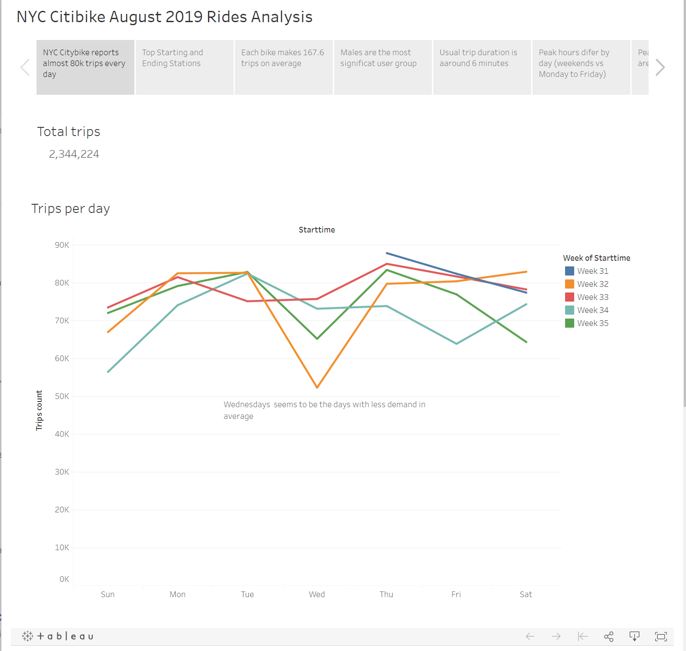
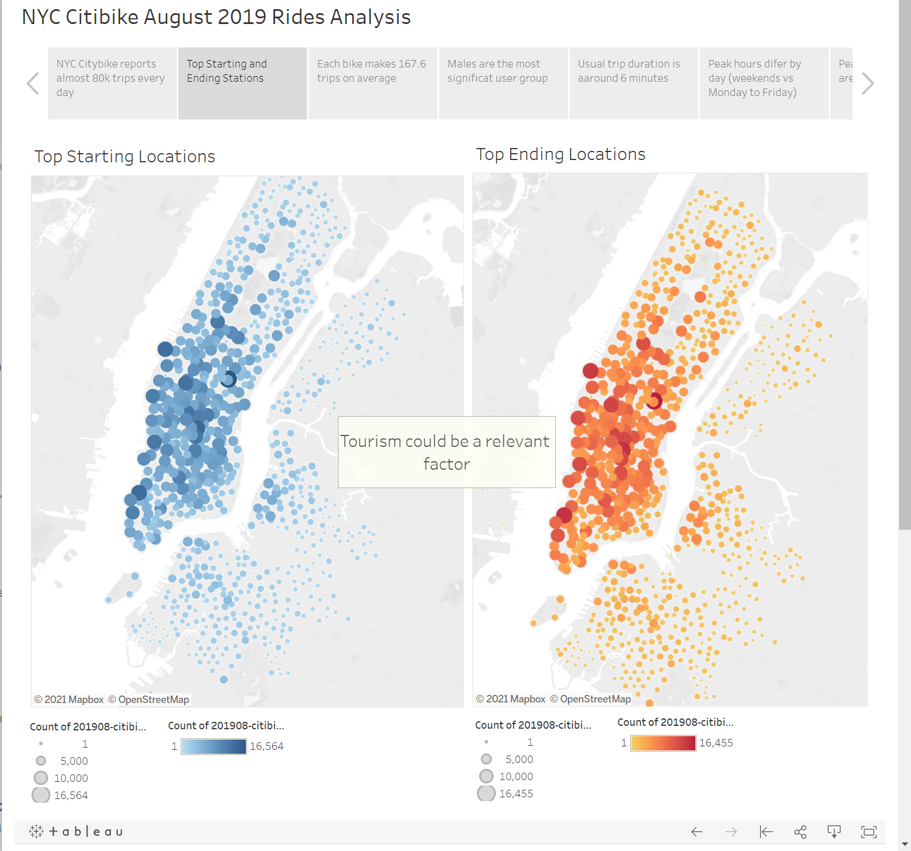
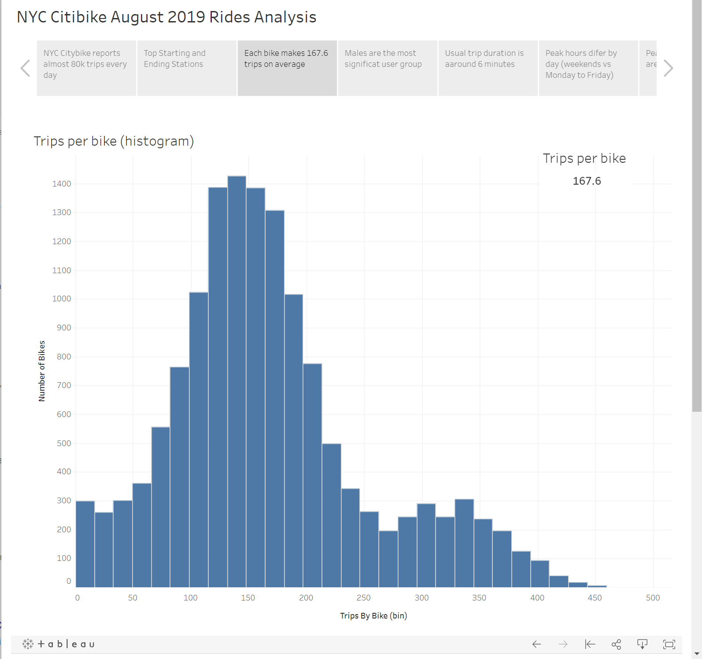
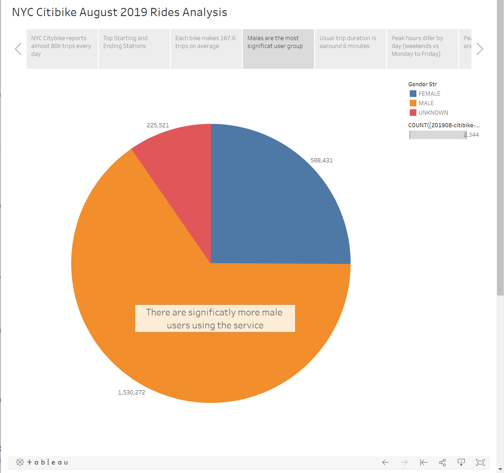
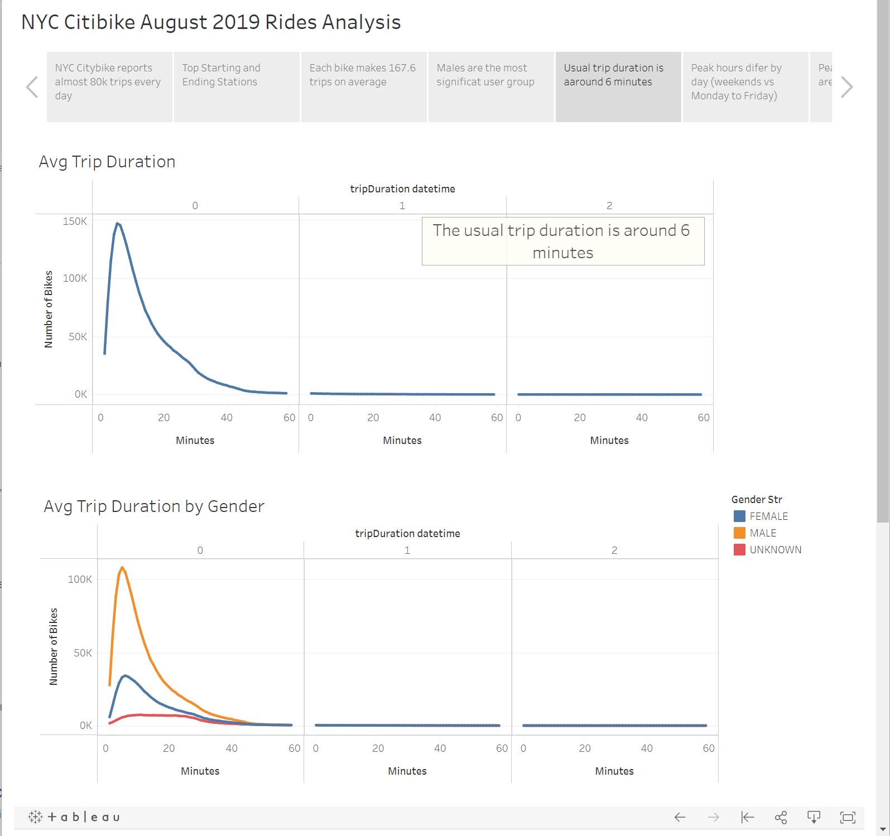
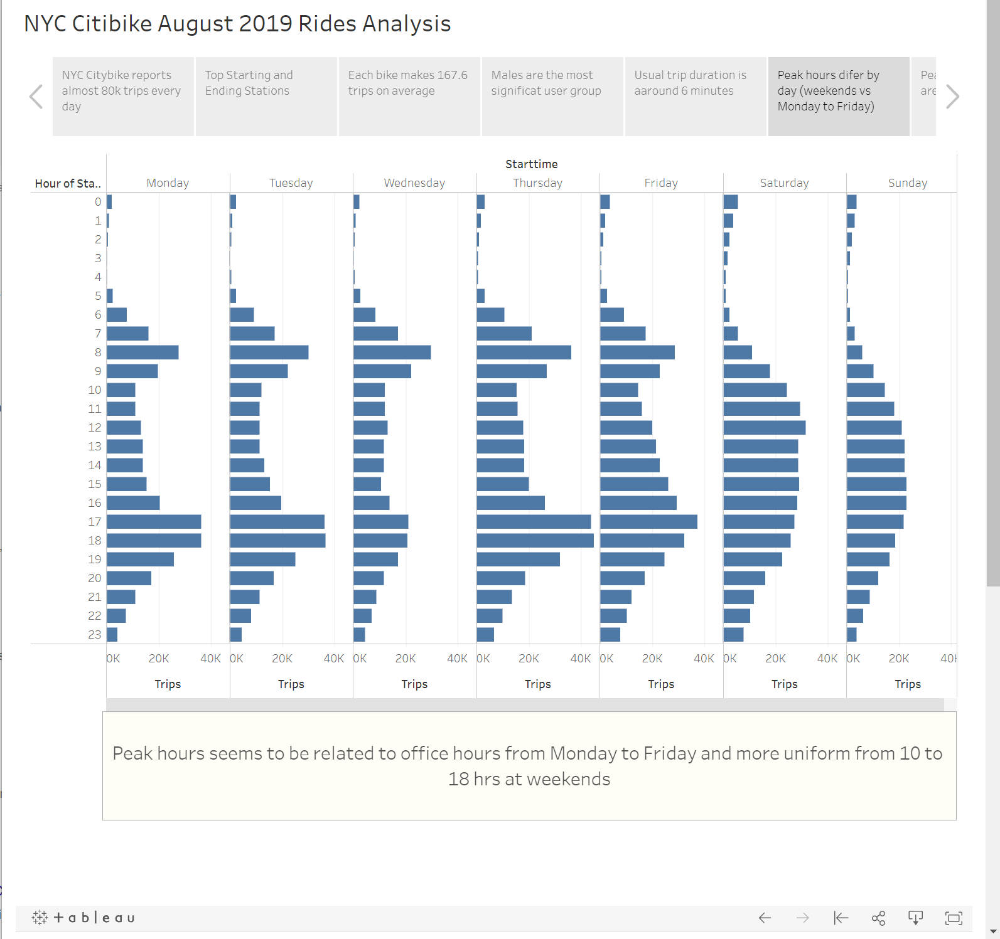
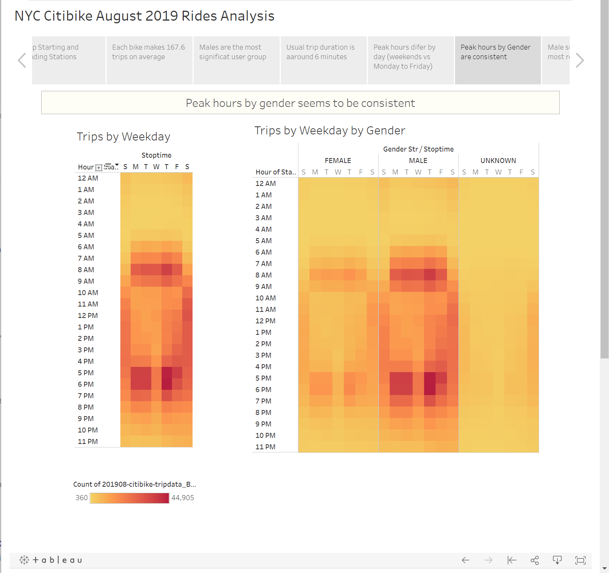
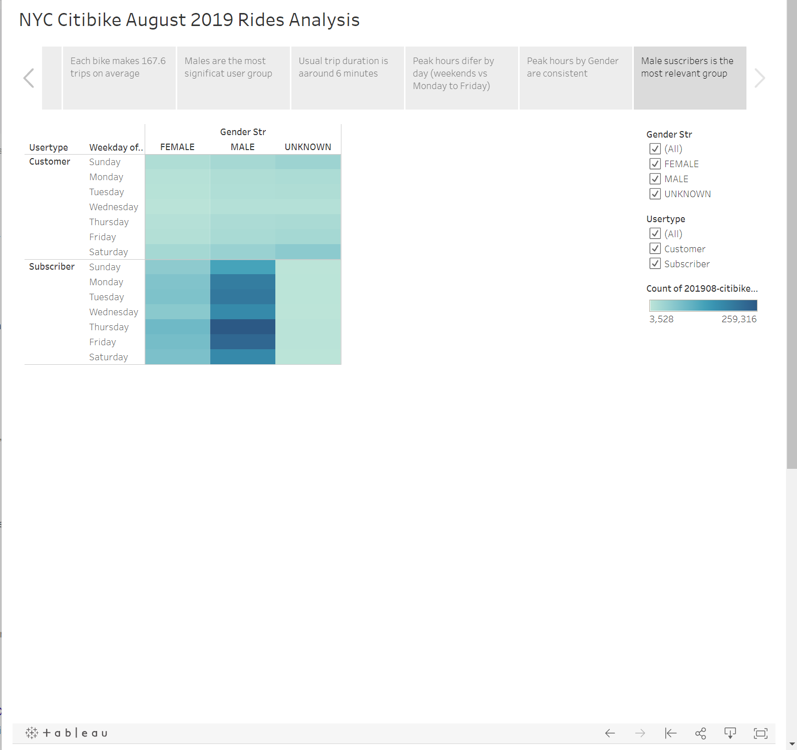

# bikesharing

## Overview

- The purpose of this analysis is to produce a tableau dashboard that could help to understand thebasic drivers of a bikeshare service of New York in order to translate the know how to another city.

## Results

[link to dashboard](https://public.tableau.com/views/Bikesharing2_16326193897100/NYCCitibikeAugust2019RidesAnalysis?:language=en-US&publish=yes&:display_count=n&:origin=viz_share_link)

- This analysis si based on the rides of August 2019 as it could be an example of the top season for the service

## Summary

- Some relevant observations obtained on this analysis are:
  - The Top Starting and Ending Stations could be related to tourism, this should warn about the demand of the service and bicycle trips on cities with less visitors.
  - NY City's population density is very high; the average duration of the trip (6 minutes) could be related to this.
  - Males are the most relevant group of users from gender perspective, this should be further analyzed and understand is there any security concern for females, or any other issue.
  - Peak hours are more related to office hours from Monday to Friday, ando mor uniform from 10 to 18 hrs. at weekends.
  - Peak hours seems to be very similar by gender
  - Subscription seems to be very popular
  
- Aditional visualization added:
  - Trips per bike histogram to understand better bike productivity
  - Trips per hour per day to better observe peak hours
